```mermaid
graph TD
    subgraph "User's Browser"
        User(👤 User)
        Frontend[🌐 Next.js Frontend]
    end

    subgraph "Cloud Platform (e.g., Vercel)"
        Backend[🚀 FastAPI Backend]
    end

    subgraph "AI Core (Managed by Backend)"
        Agent[🤖 LangChain Agent]
        LLM[🧠 LLM: gpt-4o]
        VDB[(🗄️ ChromaDB<br>Vector Store)]
        APIs(📡 External APIs<br>e.g., Tavily)
    end

    subgraph "Data Sources"
        Uploads(📄 User Files<br>logs, diffs, pngs)
        KnowledgeBase(📚 Historical Postmortems)
    end

    %% --- Flows ---
    User -- "Interacts with UI" --> Frontend
    User -- "1. Uploads Incident Files" --> Uploads
    Frontend -- "2. Sends API Request with Files" --> Backend

    Backend -- "3. Invokes Agent" --> Agent
    Agent -- "4. Gets Historical Context (RAG)" --> VDB
    Agent -- "5. Gets External Info" --> APIs
    Agent -- "6. Reasons & Synthesizes" --> LLM

    LLM -- "Returns Final Analysis" --> Agent
    Agent -- "Returns Final Analysis" --> Backend
    Backend -- "7. Sends JSON Summary" --> Frontend
    Frontend -- "8. Displays Summary" --> User

    %% --- Data Ingestion (Offline Process) ---
    KnowledgeBase -- "Ingested & Vectorized" --> VDB

    %% --- Styling ---
    style User fill:#D6EAF8,stroke:#333,stroke-width:2px
    style Frontend fill:#AEB6BF,stroke:#333,stroke-width:2px
    style Backend fill:#AED6F1,stroke:#333,stroke-width:2px
    style Agent fill:#A9DFBF,stroke:#333,stroke-width:2px
    style VDB fill:#F5B7B1,stroke:#333,stroke-width:2px
```

# Oncall Lens : Oncall Incident Summarizer

---

This document outlines the plan for building, evaluating, and improving an agentic RAG application designed to assist on-call engineers during incident response.

### **Task 1: Defining your Problem and Audience**

- **Problem Statement:** On-call engineers lose critical time during production incidents manually parsing scattered and unstructured logs, tracebacks, and configuration diffs to diagnose the root cause.
- **Problem Details:** When an incident occurs, an on-call Site Reliability Engineer (SRE) is under immense pressure to restore service as quickly as possible. The key challenge is information overload. Data is spread across multiple systems: logging platforms (Splunk, Datadog), metric dashboards, git histories, and chat channels. The engineer must manually piece together a timeline, correlate events, and identify the breaking change or failure point. This process is slow, stressful, and prone to error, directly increasing the Mean Time to Resolution (MTTR). It also leads to engineer burnout and makes knowledge transfer about past incidents difficult.
    
    The user is trying to answer questions like:
    
    - What changed in the last hour that could have caused this?
    - Where is this specific error message originating from?
    - Have we ever seen an incident like this before? What was the fix?

### **Task 2: Propose a Solution**

- **Proposed Solution:** My solution is the **Oncall Lens : Oncall Incident Summarizer**, an intelligent web application that acts as an expert assistant. An engineer can upload all relevant incident artifacts—log snippets, error stack traces, `git diff` outputs, and even screenshots of metric graphs. The application's agentic backend will process these varied inputs, retrieve context from a knowledge base of past incidents, and generate a concise, actionable summary.
    
    This summary will pinpoint the most likely failure points, suggest immediate next steps for diagnosis, and surface links to similar historical incidents. This transforms the user's experience from a frantic, manual search to a guided, accelerated investigation. In this "better world," engineers can diagnose issues faster, reduce MTTR, and build a living, searchable history of incidents that benefits the entire organization.
    
- **Technology Stack:**
    - **LLM:** OpenAI's `gpt-4o`. I chose this model for its strong reasoning capabilities across mixed data types and its multi-modal capacity to interpret screenshots.
    - **Embedding Model:** OpenAI's `text-embedding-3-small`. This provides a great starting balance of high performance and cost-efficiency for the prototype.
    - **Orchestration:** LangChain. I chose LangChain for its comprehensive ecosystem and robust tools for building and tracing complex, multi-step agentic workflows.
    - **Vector Database:** ChromaDB. It's open-source and runs locally, making it ideal for rapid prototyping without infrastructure overhead.
    - **Monitoring:** LangSmith. I selected LangSmith because its tight integration with LangChain offers unparalleled visibility for debugging agent behavior and evaluating performance.
    - **Evaluation:** RAGAS. This is the specified framework, and it provides the key, interpretable metrics needed to quantitatively assess a RAG pipeline's performance.
    - **User Interface:** **Next.js**. I chose Next.js because it is a production-grade React framework that enables the creation of fast, SEO-friendly, and highly interactive web applications. Its component-based architecture will make the UI modular and easy to maintain, and it has first-class deployment support on Vercel.
    - **Backend Framework:** **FastAPI**. I chose FastAPI to serve the Python-based agent and business logic. It is an extremely high-performance framework that automatically generates interactive API documentation (via Swagger UI), which is invaluable for development and for separating frontend/backend concerns.
- **Use of Agents:** An agent will orchestrate the entire workflow. Upon receiving the uploaded files, the agent will first use **agentic reasoning** to decide which tools to apply—for example, using an OCR tool for image files or a code parser for log files. It will then query the vector database for historical context and use an external search tool for unknown error messages. Finally, the agent will synthesize all of this information into a coherent, structured summary, demonstrating its ability to plan and execute a complex, multi-step task.

### **Task 3: Dealing with the Data**

- **Data Sources and APIs:**
    1. **User-Uploaded Incident Artifacts:** The primary data source will be files uploaded by the user for a live incident. This includes `.log` files, `.txt` files with stack traces, `.diff` files, and `.png`/`.jpg` screenshots of dashboards. These provide the immediate context.
    2. **Historical Postmortems:** A collection of Markdown files from a knowledge base (e.g., Confluence or a git repo) containing postmortems of past incidents. This corpus will be vectorized to provide historical context and find similar incidents.
    3. **External API:** Tavily Search API. This will be used as a tool for the agent to look up external documentation on public error codes, library-specific issues, or vulnerabilities that are not present in the internal knowledge base.
- **Chunking Strategy:** I will start with a **RecursiveCharacterTextSplitter** that is sensitive to common programming syntax. For documents like logs and diffs, I will set separators like `\n\n`, `\n`, and function or class definitions to keep logical blocks of code or text together. This is superior to a simple fixed-size chunking strategy, which could sever a critical log entry or function definition, thereby destroying its semantic meaning and crippling the retrieval process.

### **Task 4: Building a Quick End-to-End Prototype (Revised Plan)**

The plan is to build the backend API first, then the frontend to consume it.

My plan is to build a decoupled frontend and backend that communicate via a REST API.

**1. Backend Development (FastAPI)**

- **Setup:** Initialize a Python project with a virtual environment and install dependencies (`fastapi`, `uvicorn`, `langchain`, `openai`, `chromadb`, etc.). Enable CORS middleware to allow requests from the frontend during local development.
- **API Endpoints:** Create a `main.py`. Define a primary API endpoint, such as `/summarize`. This endpoint will be designed to accept file uploads (e.g., `.log`, `.png`).
- **Agent Logic:** Inside the `/summarize` endpoint, the FastAPI function will receive the uploaded files, trigger the LangChain agent to perform the analysis and RAG, and receive the final summary.
- **Data Contract:** The endpoint will return a JSON object containing the summary, sources, or any errors. Example: `{ "summary": "...", "confidence_score": 0.95 }`.
- **Local Deployment:** Run the backend server locally using `uvicorn main:app --reload`.

**2. Frontend Development (Next.js)**

- **Setup:** In a separate folder, initialize a Next.js project using `npx create-next-app@latest --typescript`.
- **UI Components:** Create React components for the user interface, including a file uploader (supporting multi-file drag-and-drop) and a display area to render the markdown summary received from the backend.
- **API Communication:** Write a client-side function (e.g., in a `services` folder) that uses `fetch` or `axios` to send the uploaded files to the `http://localhost:8000/summarize` backend endpoint.
- **State Management:** Implement state management (e.g., using React's `useState` or `useReducer`) to handle loading states, errors, and the final summary data.
- **Local Deployment:** Run the frontend development server using `npm run dev`.

### **Task 5: Creating a Golden Test Data Set**

- **RAGAS Baseline Assessment:** To create a "Golden Data Set," I will use LangChain's synthetic data generation capabilities to automatically create question-context-answer-ground_truth tuples from my corpus of historical postmortems. For example, for a postmortem about a database failure, it might generate the question, "What was the root cause of the July 15th database outage?". I will then run this generated test set against my naive RAG prototype and use RAGAS to evaluate the results.
    
    My *expected* initial baseline results would look like this:
    

| Metric | Score |
| --- | --- |
| Faithfulness | 0.91 |
| Answer Relevancy | 0.88 |
| Context Precision | 0.75 |
| Context Recall | 0.72 |
- **Conclusions:** These initial results would indicate that the generation part of the pipeline is strong (high faithfulness and answer relevancy), meaning the LLM is good at answering questions given the context. However, the retrieval part is a significant bottleneck (lower context precision and recall). This tells me the pipeline is often failing to retrieve the most relevant or complete information from the vector store, which is the most critical area to improve.

### **Task 6: The Benefits of Advanced Retrieval**

- **Planned Retrieval Techniques:** To address the weaknesses identified in Task 5, I will test several advanced retrieval techniques.
    1. **Parent Document Retriever:** This technique retrieves smaller, specific chunks for semantic matching but provides the larger parent chunk (e.g., a whole section of a postmortem) to the LLM for better context. I believe this will be useful for providing the LLM with a more complete picture without sacrificing precision.
    2. **Hybrid Search:** This combines keyword-based search (like BM25) with semantic vector search. I believe this will be essential for matching specific, literal strings like error codes or function names, which pure semantic search can sometimes miss.
    3. **Multi-Query Retriever:** This uses an LLM to generate multiple variations of a user's query from different perspectives. I believe this will help uncover relevant documents that the original query phrasing might have missed, improving recall.
- These techniques will be implemented and tested within the existing LangChain framework, replacing the naive retriever.

### **Task 7: Assessing Performance**

- **Performance Comparison:** I will run the same RAGAS evaluation from Task 5 against the improved application that uses a combination of the advanced retrieval techniques (e.g., Hybrid Search + Parent Document Retriever).
    
    The *expected* results, demonstrating the improvement, are shown in the table below:
    

| Metric | Naive RAG | Advanced RAG |
| --- | --- | --- |
| Faithfulness | 0.91 | 0.95 |
| Answer Relevancy | 0.88 | 0.94 |
| Context Precision | 0.75 | **0.92** |
| Context Recall | 0.72 | **0.90** |

`This table shows a significant improvement in **context precision and recall**, confirming that the advanced retrieval methods successfully addressed the primary bottleneck of the initial prototype.`

- Future Application Improvements:
    
    In the second half of the course, I plan to focus on the following enhancements:
    
    1. **Fine-Tune an Embedding Model:** Fine-tune an open-source embedding model on our specific codebase and logs to better capture the semantic meaning of our proprietary technical jargon.
    2. **Implement Graph RAG:** Build a knowledge graph that maps service dependencies, ownership, and incident histories. This would allow the agent to reason about blast radius and causality in a much more sophisticated way.
    3. **Add a User Feedback Loop:** Incorporate a simple "thumbs up/down" feature on the generated summaries. This feedback will be collected and used to create a preference dataset for future fine-tuning (RLHF), continually improving the agent's performance.
    4. **The Multi-Agent Team:** Instead of one agent orchestrating everything, you would create a team of specialized agents that collaborate. The RAG functionality would be encapsulated within one or more of these specialist agents. By using this multi-agent approach, we retain the core RAG functionality within a specialized agent while building a more robust, modular, and scalable system that can handle more complex reasoning and workflows. 

---

## **Cliché Check: Differentiation from Existing AI Solutions**

*“Is this a cliché AI use case? Can ChatGPT already perform this function, or are there other AI products offering similar solutions?”*

That's an excellent and insightful question. It gets to the heart of AI product management: understanding the existing landscape and your unique value proposition.

Let's break it down.

### 1. Is this a cliché AI use case?

No, it's not a cliché, but it is a **classic and high-value application** of a now-common AI pattern (Agentic RAG).

- A **cliché** use case is something like a basic "chat with your single PDF" app that every beginner tutorial covers. It's a great learning tool but has limited real-world complexity.
- The **Oncall Incident Summarizer** is a level above that. It tackles a multi-faceted, high-pressure business problem. It requires handling diverse, unstructured data (logs, code, images), implementing more sophisticated retrieval strategies (hybrid search, parent document), and using an agent to reason and orchestrate a complex workflow.

While the underlying technology pattern is becoming standard, its application to the specific, messy domain of incident response makes it a powerful and non-trivial project.

### 2. Can ChatGPT already do this?

**No, not in the integrated, automated way your product proposes.**

An engineer could *manually* try to replicate a single run:

1. Open ChatGPT.
2. Copy and paste the relevant log snippets.
3. Copy and paste the `git diff`.
4. Copy and paste the text from a relevant past postmortem they managed to find.
5. Upload a screenshot of a dashboard.
6. Write a very detailed prompt asking it to synthesize everything.

The problems with this manual approach are obvious:

- **No Private Knowledge Base:** ChatGPT has no persistent, searchable access to your company's entire history of incident postmortems. This is the biggest differentiator. Your RAG application connects to a private, curated knowledge base, enabling it to find "similar incidents" automatically.1
- **Inefficient Workflow:** The manual process is slow and cumbersome, defeating the purpose of speeding up incident response.2
- **Context Window Limits:** For a complex incident, the amount of relevant data could easily exceed the context window.
- **Lack of Specialization:** Your application is fine-tuned for one purpose. The prompts, data parsing, and output format are all engineered to give an SRE exactly what they need, every time. ChatGPT's output would be more generic.

Your proposed solution isn't just an LLM; it's an **end-to-end system** that automates the entire process of data gathering, retrieval, and synthesis.

### 3. Are other AI products doing the same thing?

**Yes, absolutely.** This is a hot and competitive space known as **AIOps** (AI for IT Operations).

Major observability platforms are heavily invested here:

- **Datadog** has **"Bits AI,"** an assistant that helps diagnose issues, analyze logs, and generate reports directly within their platform.3
- **New Relic** has **"New Relic Grok,"** the first generative AI assistant for observability, designed to simplify analysis.4
- **Splunk** has its own **AI Assistants** to help with searching and analyzing machine data.5

There are also numerous startups building AI-native tools for incident management and response.6

**However, do not be discouraged by this! This is a huge validation.** The fact that multi-billion dollar companies are building products to solve this exact problem proves two things:

1. The problem you've identified is real, painful, and extremely valuable to solve.
2. Building a custom version is a fantastic portfolio project because it mirrors what real AI engineering teams are doing at top tech companies *right now*.

For the purpose of your Certification Challenge, building your own **Oncall Incident Summarizer** demonstrates that you can identify a high-value business problem and apply modern AI engineering principles to build a robust, enterprise-grade solution.

---

## More Future Enhancements : The Multi-Agent Team

The solution can be evolved into a multi-agent system while keeping RAG as a central component. This is a natural and powerful way to add more complexity and capability to the initial design.

Instead of one agent orchestrating everything, you would create a team of specialized agents that collaborate. The RAG functionality would be encapsulated within one or more of these specialist agents.

Here is a plausible multi-agent architecture for your **Oncall Incident Summarizer**:

### The Multi-Agent Team

1. **The Manager Agent (Orchestrator):**
    - **Role:** This is the team lead. It receives the initial request from the user (the uploaded incident files).
    - **Function:** It doesn't find the answer itself. Its job is to analyze the request, create a plan, and delegate tasks to the appropriate specialist agents.2 It then gathers the findings from its team and passes them to the final reporting agent.
2. **The Data Triage Agent:**
    - **Role:** A data-parsing specialist.
    - **Function:** This agent receives the raw files (`.log`, `.diff`, `.png`) from the Manager. It uses specific tools to parse the logs, extract code from diffs, and perform OCR on the screenshots. Its output is clean, structured text and data that other agents can easily use.
3. **The Historical Analyst Agent (The RAG Specialist):**
    - **Role:** The internal knowledge expert.
    - **Function:** **This is where your RAG pipeline lives.** The Manager tasks this agent with finding historical context. It takes the structured data from the Triage Agent, formulates queries, and interacts deeply with the ChromaDB vector store of past incidents. Its deliverable is a summary of similar past incidents, their root causes, and their resolutions.
4. **The External Researcher Agent:**
    - **Role:** The public internet specialist.
    - **Function:** If the Triage Agent extracts a specific error code (e.g., `PGRST-1138`) or a public library name, the Manager can delegate a task to this agent. It uses the Tavily Search API to find public documentation, GitHub issues, or Stack Overflow posts related to that error.
5. **The Synthesizer Agent (Reporter):**
    - **Role:** The final communicator.
    - **Function:** This agent receives the structured findings from the Historical Analyst and the External Researcher. Its sole purpose is to synthesize all this information into the final, coherent, and actionable summary that is presented to the on-call engineer.

### How it Works Together

1. User uploads files.
2. The **Manager Agent** assesses the files and creates a plan: "Task 1: Triage data. Task 2: Find historical context. Task 3: Research error code 'X'. Task 4: Synthesize a final report."
3. It passes the files to the **Data Triage Agent**.
4. The Triage Agent returns structured data.
5. The **Manager Agent** sends this structured data to the **Historical Analyst Agent** (RAG) and the **External Researcher Agent** to work in parallel.
6. Each specialist agent returns its findings.
7. The **Manager Agent** collects these findings and hands them to the **Synthesizer Agent**, instructing it to write the final summary.
8. The final summary is displayed to the user.

By using this multi-agent approach, you retain the core RAG functionality within a specialized agent while building a more robust, modular, and scalable system that can handle more complex reasoning and workflows. 

---

