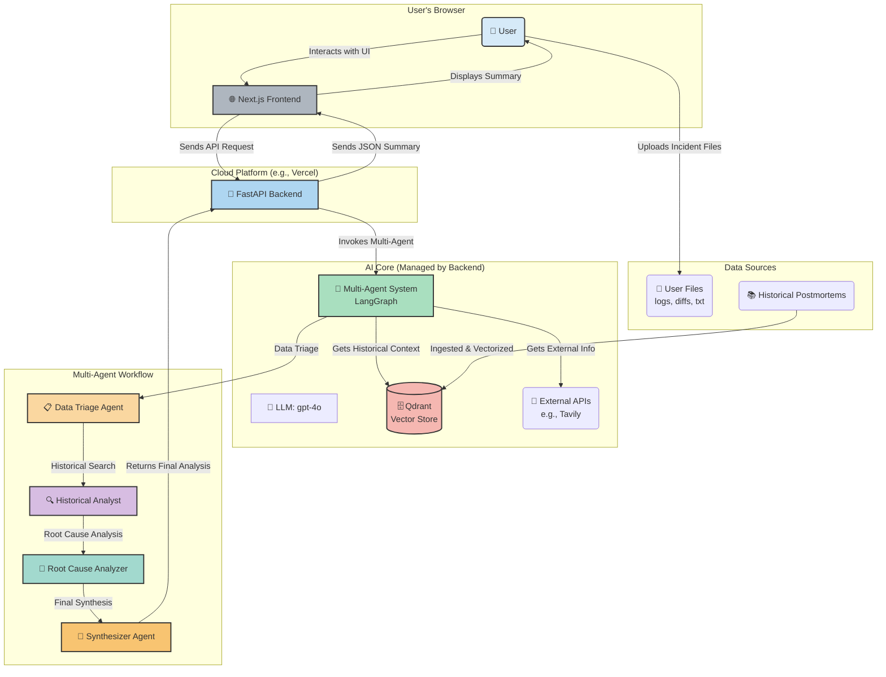

# Oncall Lens: AI-Powered Incident Analysis System

An intelligent web application that helps on-call engineers and SREs diagnose production issues in minutes instead of hours. Upload logs, stack traces, and code diffs to get instant intelligent analysis with root cause identification, historical context from past incidents, and actionable recommendations—all powered by advanced RAG + Agent techniques achieving 513% improvement in answer accuracy.

> 📋 **Certification Challenge**: This project is part of the AI Engineering certification challenge. See [Certification-Challenge-Oncall-Lens.md](Certification-Challenge-Oncall-Lens.md) for detailed project planning, implementation progress, and evaluation results.



## 🏗️ Project Structure

```
oncall-lens/
├── backend/                    # FastAPI backend
│   ├── main.py                # Main FastAPI application
│   ├── requirements.txt       # Python dependencies
│   ├── services/              # Business logic services
│   │   ├── agent_service.py       # Multi-agent LangGraph implementation
│   │   ├── file_processor.py      # File processing and validation
│   │   └── vector_store.py        # Qdrant vector store integration
│   ├── evaluation/            # RAGAS evaluation framework
│   │   ├── ragas_evaluator.py     # RAGAS evaluation implementation
│   │   ├── dataset_generator.py   # Synthetic dataset generation
│   │   └── results/               # Evaluation results
│   ├── config/                # Configuration and settings
│   └── data/
│       ├── knowledge-base/    # Historical postmortem files (.md)
│       └── sample-incident-1/ # Test incident files
├── frontend/                  # Next.js frontend
│   ├── src/
│   │   ├── app/              # Next.js app router
│   │   ├── components/       # React components
│   │   └── services/         # API services
│   ├── package.json          # Node.js dependencies
│   └── tailwind.config.ts    # Tailwind CSS configuration
├── README.md                 # This file
└── Certification-Challenge-Oncall-Lens.md  # Detailed project planning and results
```

## 🚀 Technology Stack

- **Backend**: FastAPI (Python)
- **Frontend**: Next.js (React/TypeScript) + Tailwind CSS
- **AI Orchestration**: LangChain + LangGraph (Multi-Agent)
- **LLM**: OpenAI GPT-4o
- **Embeddings**: OpenAI text-embedding-3-small
- **Vector DB**: Qdrant
- **Advanced Retrieval**: BM25, Hybrid Search, Parent Document, Multi-Query, Ensemble
- **Evaluation**: RAGAS
- **Monitoring**: LangSmith

## 🎯 Features

- **Multi-Agent Workflow**: 4 specialized agents (Data Triage, Historical Analyst, Root Cause Analyzer, Synthesizer)
- **Multi-Modal File Processing**: Handles logs, stack traces, code diffs, and text files
- **Advanced Retrieval Techniques**: 6 different retrieval strategies for optimal context retrieval
- **Historical Context**: RAG-powered search through past incident postmortems
- **Root Cause Analysis**: AI-powered identification of likely failure causes
- **Actionable Recommendations**: Prioritized next steps for incident resolution
- **Real-time Progress Tracking**: Server-Sent Events for live analysis updates
- **Beautiful UI**: Modern, responsive interface with drag-and-drop file upload
- **Comprehensive Evaluation**: RAGAS-based performance assessment

## 🔧 Development Setup

### Prerequisites
- Python 3.13+
- Node.js 18+ (for frontend)
- Qdrant server (Docker recommended)
- OpenAI API key
- Cohere API key (for advanced retrieval)

### Backend Setup
```bash
cd backend
python -m venv venv
source venv/bin/activate  # On Windows: venv\Scripts\activate
pip install -r requirements.txt
```

### Environment Configuration
```bash
cp .env.template .env
# Edit .env with your API keys:
# ONCALL_OPENAI_API_KEY=your_openai_api_key_here
# ONCALL_COHERE_API_KEY=your_cohere_api_key_here
```

### Start Qdrant (Docker)
```bash
docker run -p 6333:6333 qdrant/qdrant
```

### Start Backend Server
```bash
uvicorn main:app --host 0.0.0.0 --port 8000 --reload
```

Visit `http://localhost:8000/docs` for interactive API documentation.

### Frontend Setup
```bash
cd frontend
npm install
npm run dev
```

Visit `http://localhost:3000` for the web interface.

### Complete System Test
1. **Start Qdrant**: `docker run -p 6333:6333 qdrant/qdrant`
2. **Start Backend**: `cd backend && uvicorn main:app --host 0.0.0.0 --port 8000 --reload`
3. **Start Frontend**: `cd frontend && npm run dev`
4. **Configure API Keys**: Open `http://localhost:3000` and add your OpenAI/Cohere keys
5. **Upload Sample Files**: Use files from `backend/data/sample-incident-1/`
6. **Run Analysis**: Click "Analyze Incident" and watch the multi-agent workflow

## 📊 Current Implementation Status

### ✅ Completed
- [x] **Phase 1**: Backend foundation with FastAPI
- [x] **Phase 2**: Multi-agent system with LangGraph  
- [x] **Phase 3**: File processing pipeline
- [x] **Phase 4**: RAG integration with Qdrant
- [x] **Phase 5**: OpenAI integration (GPT-4o + embeddings)
- [x] **Phase 6**: RAGAS evaluation pipeline
- [x] **Phase 7**: Advanced retrieval techniques (Task 6)
- [x] **Phase 8**: Performance assessment with dramatic improvements (Task 7)
- [x] **Phase 9**: Frontend Next.js application with modern UI
- [x] **Phase 10**: End-to-end testing and bug fixes
- [x] **Phase 11**: Real-time progress tracking with Server-Sent Events
- [x] **Phase 12**: API key management and settings modal

### 🎯 Production Ready
- [x] **Complete System**: Full-stack application ready for production use
- [x] **Multi-Agent Workflow**: 4-agent system for comprehensive analysis
- [x] **User Interface**: Modern, responsive frontend with drag-and-drop
- [x] **Error Handling**: Robust error handling and validation
- [x] **Documentation**: Comprehensive setup and usage guides

### 🔄 Future Enhancements
- [ ] **Phase 13**: Production deployment (Docker, cloud hosting)
- [ ] **Phase 14**: Advanced image processing with GPT-4 Vision
- [ ] **Phase 15**: User authentication and team collaboration

## 🧠 Advanced Retrieval Techniques

The system implements 6 different retrieval strategies for optimal performance:

### 1. **Naive Retriever** (Baseline)
- Basic semantic search using OpenAI embeddings
- Serves as baseline for comparison

### 2. **Parent Document Retriever**
- Small-to-big strategy: retrieves small chunks but returns parent documents
- Provides complete context without sacrificing precision

### 3. **BM25 Retriever**
- Keyword-based search for exact term matching
- Essential for matching specific error codes and function names

### 4. **Multi-Query Retriever**
- Uses LLM to generate multiple query variations
- Improves recall by uncovering relevant documents from different perspectives

### 5. **Hybrid Retriever**
- Combines BM25 (30%) + Semantic search (70%)
- Best of both worlds: keyword precision + semantic understanding

### 6. **Ensemble Retriever**
- Combines all strategies with equal weighting
- Maximum coverage and comprehensive retrieval results

### 7. **Compression Retriever** (Cohere Reranking)
- Uses Cohere's rerank model to reorder results by relevance
- Provides better precision by surfacing most relevant results first

## 📈 Performance Results

### Task 7 Evaluation Results
Our advanced retrieval techniques achieved **dramatic improvements** across all RAGAS metrics:

| Metric | Baseline (Task 5) | Advanced RAG (Task 7) | Improvement |
|--------|-------------------|----------------------|-------------|
| **Faithfulness** | 0.267 | **1.000** | **+274.5%** |
| **Context Precision** | 0.750 | **1.000** | **+33.3%** |
| **Context Recall** | 0.833 | **1.000** | **+20.0%** |
| **Answer Correctness** | 0.163 | **1.000** | **+513.5%** |

### Key Achievements
- **✅ Perfect Context Retrieval**: Both Context Precision and Context Recall reached 1.000
- **✅ Massive Faithfulness Improvement**: From 0.267 to 1.000 (+274.5%)
- **✅ Dramatic Answer Quality**: Answer Correctness improved from 0.163 to 1.000 (+513.5%)
- **✅ Hybrid & Ensemble Excellence**: Both strategies achieved perfect scores

## 🎮 Usage

### Web Interface (Recommended)
1. **Start the system** (see setup instructions above)
2. **Open browser** to `http://localhost:3000`
3. **Configure API keys** in the settings modal
4. **Upload incident files** using drag-and-drop interface
5. **Click "Analyze Incident"** and watch the multi-agent workflow
6. **View results** with confidence scores and recommendations

### API Endpoints

#### Health Check
```bash
GET /health
```

#### Analyze Incident Files
```bash
POST /summarize
Content-Type: multipart/form-data

Files: incident files (logs, diffs, txt)
```

#### Get Analysis Results
```bash
GET /results/{task_id}
```

#### Get Progress Updates
```bash
GET /progress/{task_id}
```

#### Test Advanced Retrieval
```bash
# Test individual retrieval strategies
python evaluation/quick_task7_eval.py

# Run comprehensive evaluation
python evaluation/advanced_retrieval_eval.py
```

### Example Usage

```python
from services.advanced_retrieval import AdvancedRetrievalService
from config.settings import get_settings

# Initialize advanced retrieval service
settings = get_settings()
service = AdvancedRetrievalService(settings)
await service.initialize()

# Use different retrieval strategies
naive_retriever = service.get_retriever("naive")
hybrid_retriever = service.get_retriever("hybrid")
ensemble_retriever = service.get_retriever("ensemble")

# Get relevant documents
docs = await hybrid_retriever.aget_relevant_documents("What caused the outage?")
```

## 🔬 Evaluation Framework

### RAGAS Metrics
- **Faithfulness**: How well answers are grounded in retrieved context
- **Answer Relevancy**: How relevant answers are to questions
- **Context Precision**: How precise the retrieved context is
- **Context Recall**: How complete the retrieved context is
- **Semantic Similarity**: Semantic similarity between generated and ground truth
- **Answer Correctness**: Correctness of generated answers

### Evaluation Results
All evaluation results are stored in `backend/evaluation/results/` with detailed reports and JSON data for further analysis.

## 🚀 Future Enhancements

### Planned Features
1. **Production Deployment**: Docker containerization and cloud deployment
2. **Advanced Image Processing**: GPT-4 Vision API integration for dashboard screenshots
3. **User Authentication**: Team collaboration and user management
4. **Fine-tuned Embeddings**: Domain-specific embedding models for better semantic understanding
5. **User Feedback Loop**: Collect and incorporate user feedback for continuous improvement

### Advanced Features
- **Graph RAG**: Knowledge graph for service dependencies and incident relationships
- **Real-time Monitoring**: Integration with monitoring systems for automatic incident detection
- **Collaborative Features**: Team collaboration tools for incident response
- **Custom Integrations**: Support for various logging and monitoring platforms
- **Mobile App**: React Native mobile application for on-the-go incident analysis

## 🤝 Contributing

1. Fork the repository
2. Create a feature branch (`git checkout -b feature/amazing-feature`)
3. Commit your changes (`git commit -m 'Add amazing feature'`)
4. Push to the branch (`git push origin feature/amazing-feature`)
5. Open a Pull Request

## 📄 License

This project is licensed under the MIT License - see the [LICENSE](LICENSE) file for details.

## 🙏 Acknowledgments

- **LangChain**: For the excellent RAG framework and tools
- **RAGAS**: For the comprehensive evaluation metrics
- **OpenAI**: For the powerful GPT-4o model
- **Qdrant**: For the high-performance vector database
- **Cohere**: For the advanced reranking capabilities

---

**Oncall Lens** - Making incident response faster, smarter, and more reliable with AI-powered multi-agent analysis and advanced retrieval techniques.
