# Oncall Lens: Oncall Incident Summarizer

An intelligent web application that acts as an expert assistant for on-call engineers during incident response. Upload incident artifacts (logs, stack traces, diffs, screenshots) and get AI-powered summaries with historical context using advanced retrieval techniques.

> 📋 **Certification Challenge**: This project is part of the AI Engineering certification challenge. See [Certification-Challenge-Oncall-Lens.md](Certification-Challenge-Oncall-Lens.md) for detailed project planning, implementation progress, and evaluation results.

```mermaid
graph TD
    subgraph "User's Browser"
        User(👤 User)
        Frontend[🌐 Next.js Frontend]
    end

    subgraph "Cloud Platform (e.g., Vercel)"
        Backend[🚀 FastAPI Backend]
    end

    subgraph "AI Core (Managed by Backend)"
        Agent[🤖 LangChain Agent]
        LLM[🧠 LLM: gpt-4o]
        VDB[(🗄️ Qdrant<br>Vector Store)]
        APIs(📡 External APIs<br>e.g., Tavily)
    end

    subgraph "Data Sources"
        Uploads(📄 User Files<br>logs, diffs, pngs)
        KnowledgeBase(📚 Historical Postmortems)
    end

    %% --- Flows ---
    User -->|Interacts with UI| Frontend
    User -->|Uploads Incident Files| Uploads
    Frontend -->|Sends API Request| Backend

    Backend -->|Invokes Agent| Agent
    Agent -->|Gets Historical Context| VDB
    Agent -->|Gets External Info| APIs
    Agent -->|Reasons & Synthesizes| LLM

    LLM -->|Returns Final Analysis| Agent
    Agent -->|Returns Final Analysis| Backend
    Backend -->|Sends JSON Summary| Frontend
    Frontend -->|Displays Summary| User

    %% --- Data Ingestion (Offline Process) ---
    KnowledgeBase -->|Ingested & Vectorized| VDB

    %% --- Styling ---
    style User fill:#D6EAF8,stroke:#333,stroke-width:2px
    style Frontend fill:#AEB6BF,stroke:#333,stroke-width:2px
    style Backend fill:#AED6F1,stroke:#333,stroke-width:2px
    style Agent fill:#A9DFBF,stroke:#333,stroke-width:2px
    style VDB fill:#F5B7B1,stroke:#333,stroke-width:2px
```




## 🏗️ Project Structure

```
oncall-lens/
├── backend/                    # FastAPI backend
│   ├── main.py                # Main FastAPI application
│   ├── requirements.txt       # Python dependencies
│   ├── services/              # Business logic services
│   │   ├── advanced_retrieval.py  # Advanced retrieval techniques
│   │   ├── agent_service.py       # LangChain agent implementation
│   │   └── vector_store.py        # Qdrant vector store integration
│   ├── evaluation/            # RAGAS evaluation framework
│   │   ├── ragas_evaluator.py     # RAGAS evaluation implementation
│   │   ├── dataset_generator.py   # Synthetic dataset generation
│   │   └── results/               # Evaluation results
│   ├── config/                # Configuration and settings
│   └── data/
│       ├── knowledge-base/    # Historical postmortem files (.md)
│       └── sample-incident-1/ # Test incident files
├── frontend/                  # Next.js frontend (coming soon)
├── README.md                 # This file
└── Certification-Challenge-Oncall-Lens.md  # Detailed project planning and results
```

## 🚀 Technology Stack

- **Backend**: FastAPI (Python)
- **Frontend**: Next.js (React/TypeScript) 
- **AI Orchestration**: LangChain + LangGraph
- **LLM**: OpenAI GPT-4o
- **Embeddings**: OpenAI text-embedding-3-small
- **Vector DB**: Qdrant
- **Advanced Retrieval**: BM25, Hybrid Search, Parent Document, Multi-Query, Ensemble
- **Evaluation**: RAGAS
- **Monitoring**: LangSmith

## 🎯 Features

- **Multi-Modal File Processing**: Handles logs, stack traces, code diffs, and screenshots
- **Advanced Retrieval Techniques**: 6 different retrieval strategies for optimal context retrieval
- **Historical Context**: RAG-powered search through past incident postmortems
- **Root Cause Analysis**: AI-powered identification of likely failure causes
- **Actionable Recommendations**: Prioritized next steps for incident resolution
- **Comprehensive Evaluation**: RAGAS-based performance assessment

## 🔧 Development Setup

### Prerequisites
- Python 3.13+
- Node.js 18+ (for frontend)
- Qdrant server (Docker recommended)
- OpenAI API key
- Cohere API key (for advanced retrieval)

### Backend Setup
```bash
cd backend
python -m venv venv
source venv/bin/activate  # On Windows: venv\Scripts\activate
pip install -r requirements.txt
```

### Environment Configuration
```bash
cp .env.template .env
# Edit .env with your API keys:
# ONCALL_OPENAI_API_KEY=your_openai_api_key_here
# ONCALL_COHERE_API_KEY=your_cohere_api_key_here
```

### Start Qdrant (Docker)
```bash
docker run -p 6333:6333 qdrant/qdrant
```

### Start Backend Server
```bash
uvicorn main:app --host 0.0.0.0 --port 8000 --reload
```

Visit `http://localhost:8000/docs` for interactive API documentation.

## 📊 Current Implementation Status

### ✅ Completed
- [x] **Phase 1**: Backend foundation with FastAPI
- [x] **Phase 2**: Multi-agent system with LangGraph  
- [x] **Phase 3**: File processing pipeline
- [x] **Phase 4**: RAG integration with Qdrant
- [x] **Phase 5**: OpenAI integration (GPT-4o + embeddings)
- [x] **Phase 6**: RAGAS evaluation pipeline
- [x] **Phase 7**: Advanced retrieval techniques (Task 6)
- [x] **Phase 8**: Performance assessment with dramatic improvements (Task 7)

### 🔄 In Progress  
- [ ] **Phase 9**: Frontend Next.js application
- [ ] **Phase 10**: Production deployment

## 🧠 Advanced Retrieval Techniques

The system implements 6 different retrieval strategies for optimal performance:

### 1. **Naive Retriever** (Baseline)
- Basic semantic search using OpenAI embeddings
- Serves as baseline for comparison

### 2. **Parent Document Retriever**
- Small-to-big strategy: retrieves small chunks but returns parent documents
- Provides complete context without sacrificing precision

### 3. **BM25 Retriever**
- Keyword-based search for exact term matching
- Essential for matching specific error codes and function names

### 4. **Multi-Query Retriever**
- Uses LLM to generate multiple query variations
- Improves recall by uncovering relevant documents from different perspectives

### 5. **Hybrid Retriever**
- Combines BM25 (30%) + Semantic search (70%)
- Best of both worlds: keyword precision + semantic understanding

### 6. **Ensemble Retriever**
- Combines all strategies with equal weighting
- Maximum coverage and comprehensive retrieval results

### 7. **Compression Retriever** (Cohere Reranking)
- Uses Cohere's rerank model to reorder results by relevance
- Provides better precision by surfacing most relevant results first

## 📈 Performance Results

### Task 7 Evaluation Results
Our advanced retrieval techniques achieved **dramatic improvements** across all RAGAS metrics:

| Metric | Baseline (Task 5) | Advanced RAG (Task 7) | Improvement |
|--------|-------------------|----------------------|-------------|
| **Faithfulness** | 0.267 | **1.000** | **+274.5%** |
| **Context Precision** | 0.750 | **1.000** | **+33.3%** |
| **Context Recall** | 0.833 | **1.000** | **+20.0%** |
| **Answer Correctness** | 0.163 | **1.000** | **+513.5%** |

### Key Achievements
- **✅ Perfect Context Retrieval**: Both Context Precision and Context Recall reached 1.000
- **✅ Massive Faithfulness Improvement**: From 0.267 to 1.000 (+274.5%)
- **✅ Dramatic Answer Quality**: Answer Correctness improved from 0.163 to 1.000 (+513.5%)
- **✅ Hybrid & Ensemble Excellence**: Both strategies achieved perfect scores

## 🎮 Usage

### API Endpoints

#### Health Check
```bash
GET /health
```

#### Analyze Incident Files
```bash
POST /analyze
Content-Type: multipart/form-data

Files: incident files (logs, diffs, screenshots)
```

#### Test Advanced Retrieval
```bash
# Test individual retrieval strategies
python evaluation/quick_task7_eval.py

# Run comprehensive evaluation
python evaluation/advanced_retrieval_eval.py
```

### Example Usage

```python
from services.advanced_retrieval import AdvancedRetrievalService
from config.settings import get_settings

# Initialize advanced retrieval service
settings = get_settings()
service = AdvancedRetrievalService(settings)
await service.initialize()

# Use different retrieval strategies
naive_retriever = service.get_retriever("naive")
hybrid_retriever = service.get_retriever("hybrid")
ensemble_retriever = service.get_retriever("ensemble")

# Get relevant documents
docs = await hybrid_retriever.aget_relevant_documents("What caused the outage?")
```

## 🔬 Evaluation Framework

### RAGAS Metrics
- **Faithfulness**: How well answers are grounded in retrieved context
- **Answer Relevancy**: How relevant answers are to questions
- **Context Precision**: How precise the retrieved context is
- **Context Recall**: How complete the retrieved context is
- **Semantic Similarity**: Semantic similarity between generated and ground truth
- **Answer Correctness**: Correctness of generated answers

### Evaluation Results
All evaluation results are stored in `backend/evaluation/results/` with detailed reports and JSON data for further analysis.

## 🚀 Future Enhancements

### Planned Features
1. **Frontend Application**: Next.js web interface for easy file upload and result viewing
2. **Multi-Agent Architecture**: Specialized agents for different aspects of incident analysis
3. **Fine-tuned Embeddings**: Domain-specific embedding models for better semantic understanding
4. **User Feedback Loop**: Collect and incorporate user feedback for continuous improvement
5. **Production Deployment**: Cloud deployment with monitoring and scaling

### Advanced Features
- **Graph RAG**: Knowledge graph for service dependencies and incident relationships
- **Real-time Monitoring**: Integration with monitoring systems for automatic incident detection
- **Collaborative Features**: Team collaboration tools for incident response
- **Custom Integrations**: Support for various logging and monitoring platforms

## 🤝 Contributing

1. Fork the repository
2. Create a feature branch (`git checkout -b feature/amazing-feature`)
3. Commit your changes (`git commit -m 'Add amazing feature'`)
4. Push to the branch (`git push origin feature/amazing-feature`)
5. Open a Pull Request

## 📄 License

This project is licensed under the MIT License - see the [LICENSE](LICENSE) file for details.

## 🙏 Acknowledgments

- **LangChain**: For the excellent RAG framework and tools
- **RAGAS**: For the comprehensive evaluation metrics
- **OpenAI**: For the powerful GPT-4o model
- **Qdrant**: For the high-performance vector database
- **Cohere**: For the advanced reranking capabilities

---

**Oncall Lens** - Making incident response faster, smarter, and more reliable with AI-powered analysis and advanced retrieval techniques.
